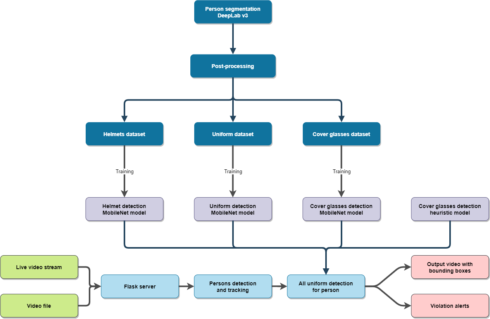

# ProHack_Agro
**Team project on ProHack 4.0. hackaton.**

**Задача:** _Создание системы видеораспознавания наличия средств индивидуальной защиты (СИЗ) на сотруднике._

**Стек:** Python 3, TensorFlow, Keras, OpenCV, Pillow, Flask.

### Функциональность

Детекция рабочей униформы на сотрудниках, наличия каски и защитных очков. Работа с потоковым видео с камер наблюдения и с видеофайлами.

### Схема финального решения:

### Краткое описание
С помощью сегментации персон на изображении, используя предобученную модель DeepLab v3, был создан датасет с 10 тысячами изображений с размеченными элементами униформы сотрудников. 
С помощью данного датасета была обучена модель MobileNet v2 для детекции элементов униформы сотрудников. 
Для улучшения качества обучения использовалась аугментация данных и дополнительные наборы данных с изображением людей без униформы.

Детекция очков реализована двумя подходами: эвристическим и с помощью глубокого обучения. Эвристический подход заключается в применении метода Виолы-Джонса для поиска лиц на сегментированном изображении и последующего поиска прямой темной линии над уровнем глаз. 
Второй подход использует предобученную сеть и применяется на сегментированном изображении человека. У каждого из подходов были свои недостатки. Они были неустойчивы в разных случаях. 
Поэтому их предикты были скомбинированы для получения более устойчивого решения.

**Moscow, November 16, 2019.**
